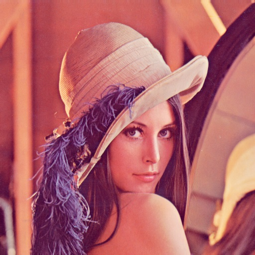

# Machine-Vision
**Projects for Machine Vision** 
- Image process
- RGB, CMYK, HSV color
- Grayscale, Binary convert
- ...

**Final Project**
```
Maze Solving
```

[Info of course](https://docs.google.com/document/d/1gpoMhuKuPmLIyiyBLLFTnVhBmvp5IChtirA4aBQCIAM/edit#heading=h.c9tbjbkrh5oo)



